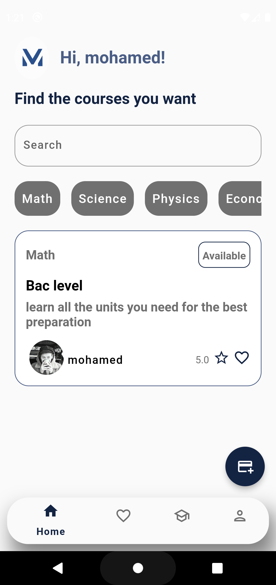
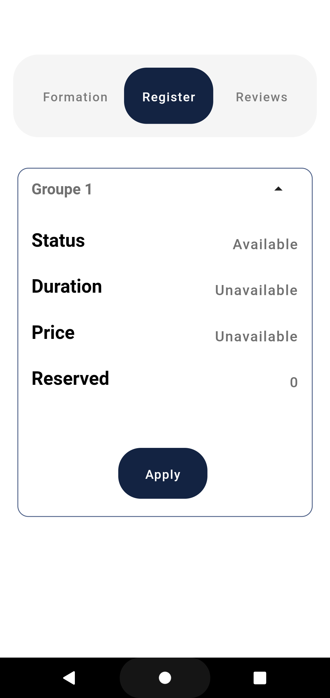
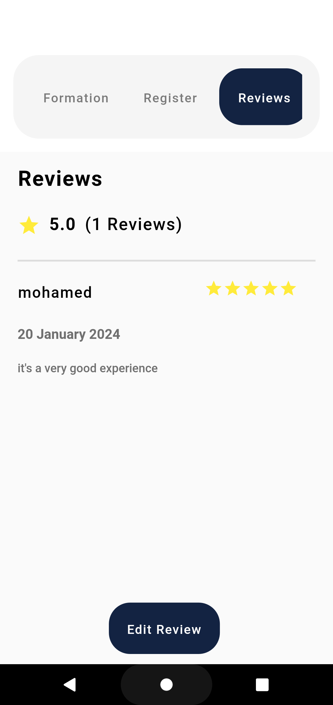
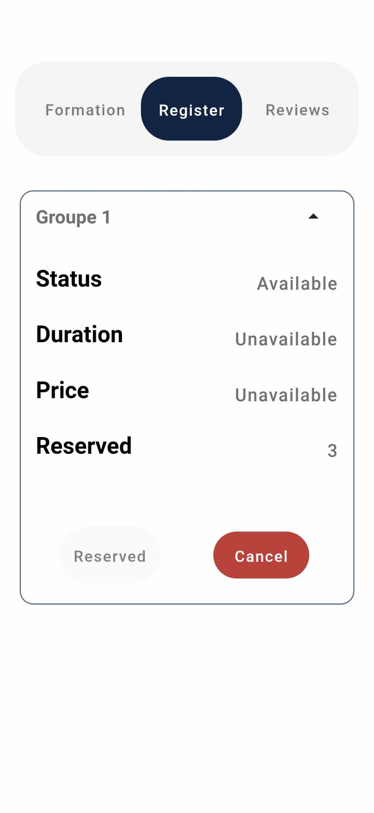
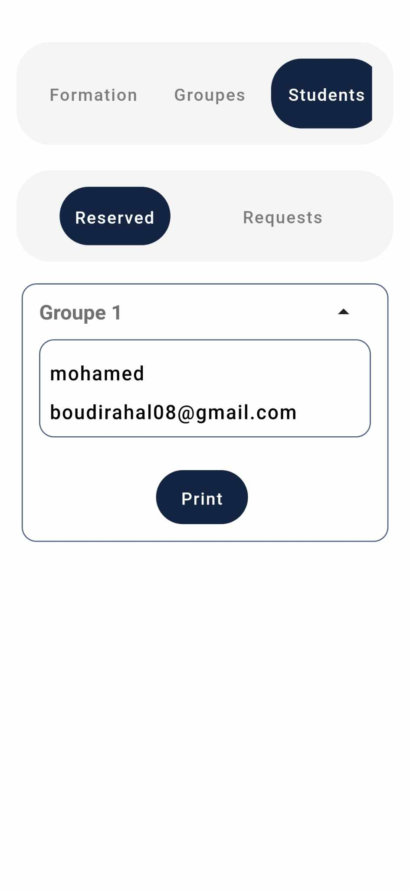

# mir

A new Flutter project.

Mir is an application to help students find the formation that aligns with their desire and with seamless registeration and three languages supported (english,arabic,french)

